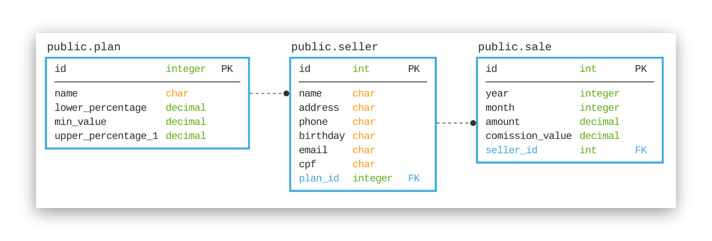
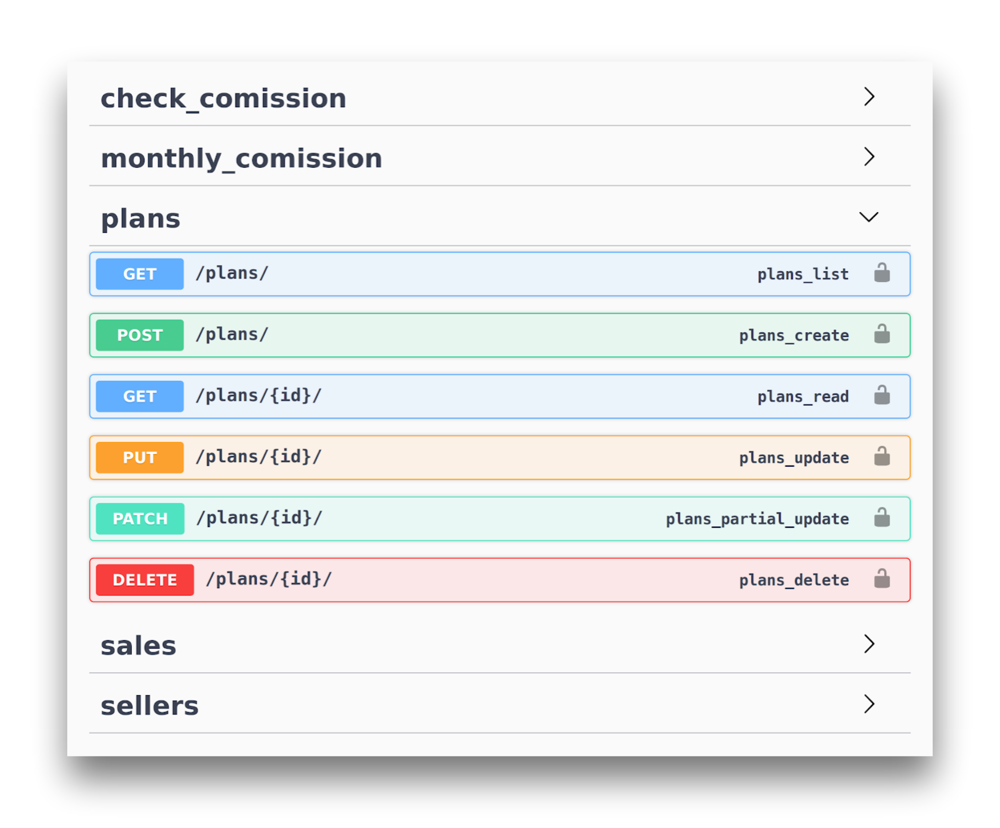

# Gestão de comissões Televendas

[Descrição do projeto](descricao.md)

### Mentor
- [Caio Carrara](https://github.com/cacarrara) 

### Integrantes da Squad 4

- [Fábio Matheus Mantelli](https://github.com/fabiomantelli)
- [Fillipe Calza](https://github.com/fcalza)
- [Julio Cezar Riffel](https://github.com/julioriffel)
- [Luan Fernando de Souza Ferreira](https://github.com/luanfsf)
- [Paulo Rogerio Kraemer](https://github.com/paulork)

### API 

O projeto final é uma API, utilizando [Django](https://www.djangoproject.com/) como framework, e a biblioteca ou toolkit [Django REST Framework](https://www.django-rest-framework.org/).

No contexto do projeto, esta API será utilizada por uma empresa de televendas, para calcular a comissão dos vendedores, de acordo com um plano de comissões. 


### Modelo de dados
De acordo com os requisitos há três entidades principais, conforme diagrama abaixo:
- `Plan` para os planos de comissão;
- `Seller` para os vendedores;
- `Sale` para as vendas;
 


### Documentação
A documentação da API foi gerada no formato OpenAPI, com a biblioteca [drf-yasg](https://drf-yasg.readthedocs.io/en/stable/).
A qual provê interfaces (swagger e redoc) para visualizar a documentação e interagir com os endpoints da API.

Exemplo da documentação dos endpoints API, acessível em `swagger/`. 
 

------

### Requisitos

- [Python](https://www.python.org/downloads/) (3.7) 
- [Pipenv](https://pypi.org/project/pipenv/2018.11.26/) (2018.11.26)
- [git](https://git-scm.com/) (2) 

Opcional (para execução com docker)

- [Docker](https://docs.docker.com/install/)
- [Docker-compose](https://docs.docker.com/compose/)

### Instalação

```
$ git clone git@github.com:codenation-dev/squad-4-ad-python-2.git
$ cd squad-4-ad-python-2

$ pip install pipenv

$ pipenv install [--dev]
```

> Ao executar o comando `$ pipenv install`, um ambiente virtual será criado automaticamente, caso não haja um ambiente virtual já ativo.

> O argumento `--dev` instalará as dependências para desenvolvimento

Para verificar o caminho do ambiente virtual criado, execute `$ pipenv --venv`.

Para acessar o ambiente ativo, execute `$ pipenv shell`


### Execução
> As variáveis de ambiente para o projeto, como debug e configurações de e-mail, devem estar setadas no arquivo `televendas/.env`, caso o arquivo não exista uma exceção será levantada.

> Há um arquivo de exemplo em [televendas/.env.example](televendas/.env.example).

No diretório do projeto
```
$ ./manage.py migrate
$ ./manage.py runserver [host]:[port]
```

- Execução com Docker CE & Docker-compose
> *Depende de [docker](https://docs.docker.com/install/) and [docker-compose](https://docs.docker.com/compose/)
```
$ docker-compose build [web db]
$ docker-compose up [web db] [-d]
```

Criar super usuário
```
$./manage.py createsuperuser
```
> Após este comando é necessário prosseguir informando os dados requisitados (username, email, password)

### Testes

```
$ ./manage.py test
```

### Cobertura de testes

Cobertura de testes do app `api`.

Executar coverage:
```
$ coverage run --source='.' manage.py test api
```
> Este comando executará os testes e gerará os dados de cobertura, e que poderão ser acessados com os comandos abaixo  

Visualizar cobertura no terminal
```
$ coverage report
```
Visualizar cobertura em html
```
$ coverage html
```
> Apoś executar o comando acima, será possível verificar a cobertura abrindo o arquivo html gerado em `htmlcov/index.html`

----

>Cobertura de código gerada em 23/07/2019, utilizado [coverage]() e [coverage-badge](https://github.com/dbrgn/coverage-badge) 
> - Projeto 
> - API 
